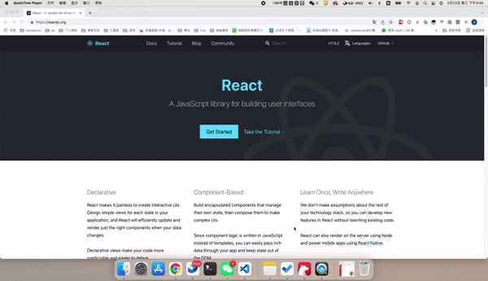
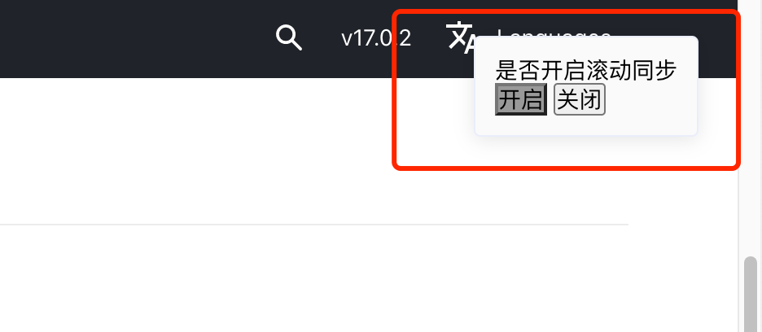
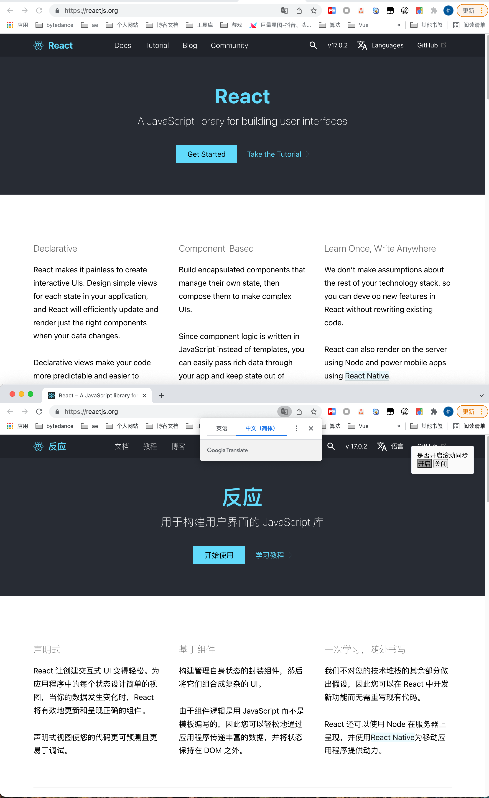

# Chrome分屏插件（翻译对比）

## 项目背景
看外文网站时，是不是经常需要一边看原文，一边看译文？ 
是不是每次都要手动的打开一个新窗口，将两个窗口缩放到比例一致的大小，再来回切换查看？ 
拥有了它，一键分屏，同步滚动，学习英语的小工具++

## 使用

 

译文的右上角可以切换 **同步滚动**。关闭后两个窗口的滚动将互不干扰

 

对于 `width` 比 `height` 大的浏览器，默认是左右分屏，反之，默认是上下分屏。竖屏下的显示器展示效果如下图： 
暂不支持修改分屏的默认设置，options页面正在开发中，敬请期待。

